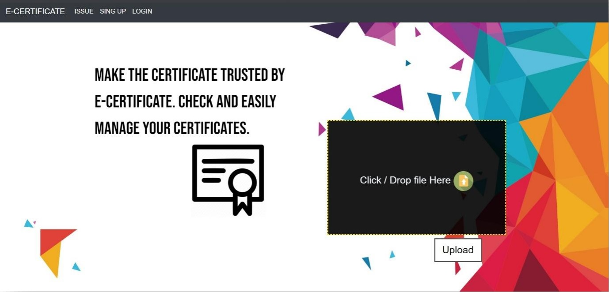
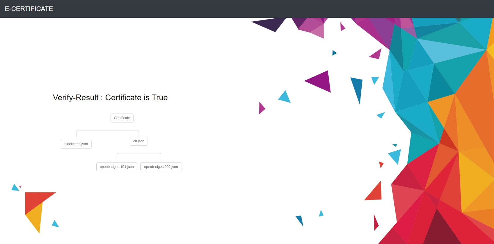
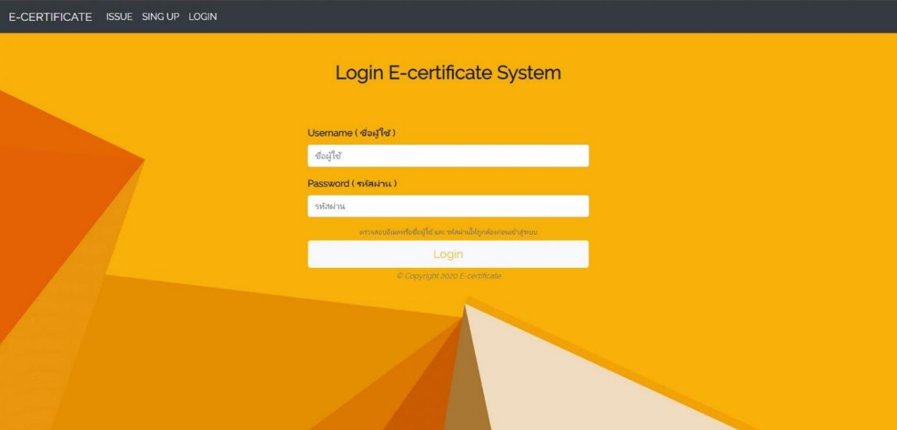
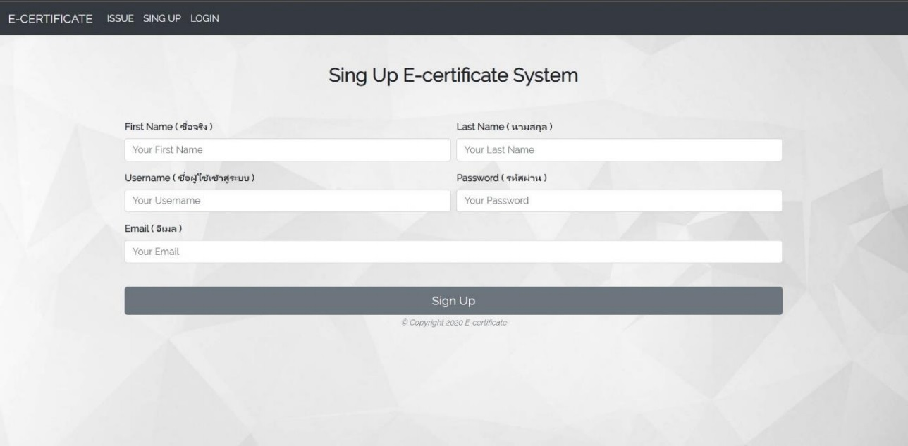
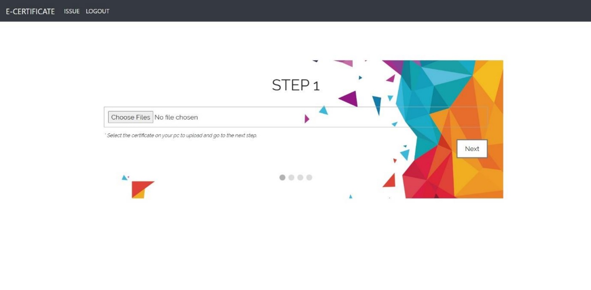
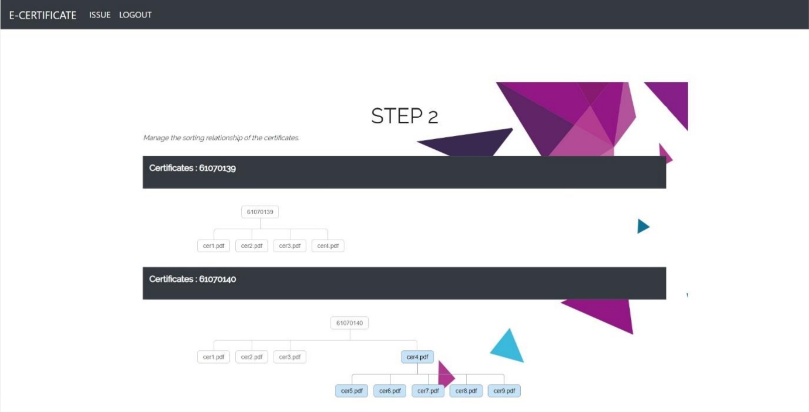

# E-Portfolio/E-Certificate with Blockchain

เป็นเว็บไซด์ในการตรวจสอบ Certificate ว่าเป็นของจริงที่ได้รับจากองค์กรต่างๆ นอกจากนี้ยังสามารถให้องค์กรหรือสถาบันต่างๆสามารถอัพโหลด Certificate ต้นฉบับ และบันทึกลงบนBlockchain ได้อีกด้วย สามารถป้องกันปัญหาการปลอมแปลง Certificate ต่างๆ

# แนวคิดเบื้องต้น (initial idea)
<ol>
	<li>ใช้ blockchain ในการบันทึกและตรวจสอบ certificates เพื่อให้มีความปลอดภัยและถูกต้องที่สุด</li>
	<li>สร้างระบบเว็บเพื่อให้ความสะดวกและบริการในการเผยแพร่ certificates ใหม่ๆ และในการตรวจสอบ certificate ว่าเป็นของจริง</li>
	<li>มีฟังก์ชันในการจัดการความสัมพันธ์ของ certificates ต่างๆในกรณีของนักเรียนคนเดียวและนักเรียนหลายคน</li>
	<li>รวบรวมหลายๆ certificates เพื่อเผยแพร่บน blockchain ในคราวเดียวกัน เพื่อลด transaction cost</li>
</ol>

# วิธีใช้งานเว็บไซด์ E-Certificate
<ul>
	<li>หน้าหลักโดยหน้านี้จะใช้อัพโหลดไฟล์ zip (ไฟล์ Certificate) เพื่อตรวจสอบว่าเป็นของจริงหรือไม่ ทำได้ทั้งหมดไม่ว่าจะลากไฟล์มาใส่ในช่อง หรือ กดเลือกไฟล์ก็ได้ เลือกเสร็จแล้วกด Upload จะลิ้งค์ไปหน้าแสดงผลของการตรวจสอบ</li>
</ul>
 

<ul>
	<li>หลังจากที่เลือกไฟล์และกด Upload แล้วเด้งไปหน้า Verify-Result จะแสดงผลว่า Certificate นี้เป็นของจริงและแสดงคาวมสัมพันธ์ของ Certificate ทั้งหมดที่เกี่ยวข้องกับ Certificate นั้นๆ</li>
</ul>
 

<ul>
	<li>หน้า Login เข้าใช้งานเว้บไซด์เพื่อทำการอัพโหลด certificate ลงบน Blockchain ซึ่งบน sidebar นั้นจะมีแถบปุ่ม ISSUE ที่จะทำการลิ้งค์ไปหน้าอัพโหลด Certificate (ถ้ายังไม่ login แล้วกดก็จะเด้งไปหน้า login เพื่อให้ login ก่อน) ซึ่งจะเข้าได้ก็ต้องทำการ Login ก่อน</li>
</ul>
 

<ul>
	<li>หน้าสมัครใช้งาน กรณีให้อาจารย์หรือทางสถาบันการศึกษาที่ต้องการ issue certificate ลงบนเว็บไซด์ เข้ามาสมัครใช้งาน</li>
</ul>
 

<ul>
	<li>เมื่อกดแถบปุ่ม ISSUE (Login เข้ามาแล้ว) จะเข้ามาหน้านี้ซึ่งเป็นหน้าที่ให้ผู้ใช้อัพโหลดไฟล์ zip (ไฟล์ certificate) ไม่ว่าจะลากไฟล์มาลงหรือกดเลือกได้ตามสะดวกเลย แล้วกดปุ่ม Next ก็จะเข้าสู่ Step ต่อไป</li>
</ul>
 

<ul>
	<li>Step ต่อไปคือการตวรจสอบความสัมพันธ์ของ certificate ที่ผู้ใช้อัพโหลดขึ้นมาใน Step ที่ผ่านมา</li>
</ul>
 

# References
<ul>
	<li><a href="https://opencerts.io/">opencerts.io</a></li>
	<li><a href="https://www.blockcerts.org/">blockcerts.org</a></li>
</ul>